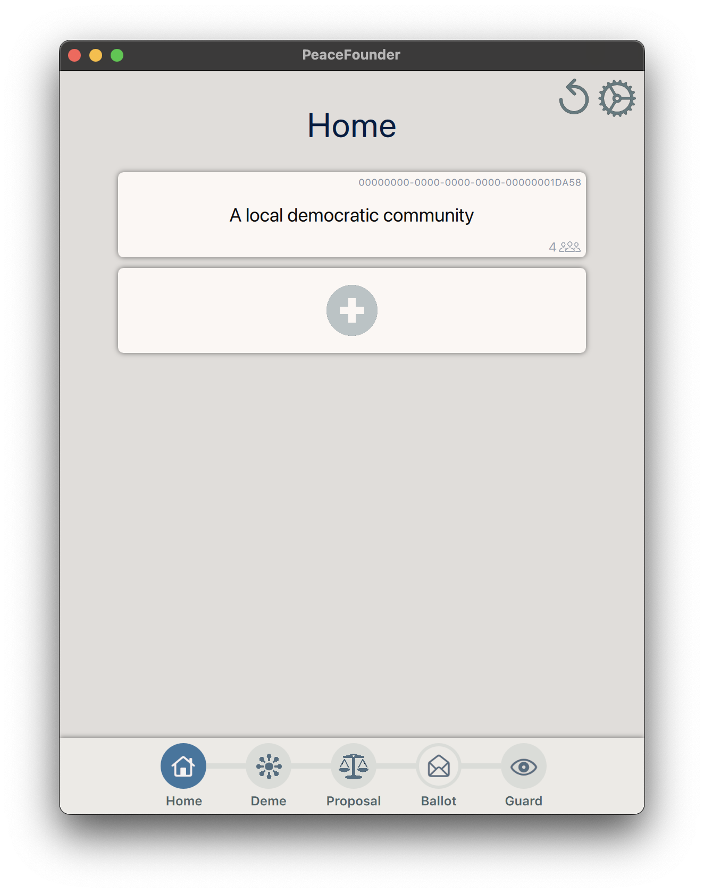
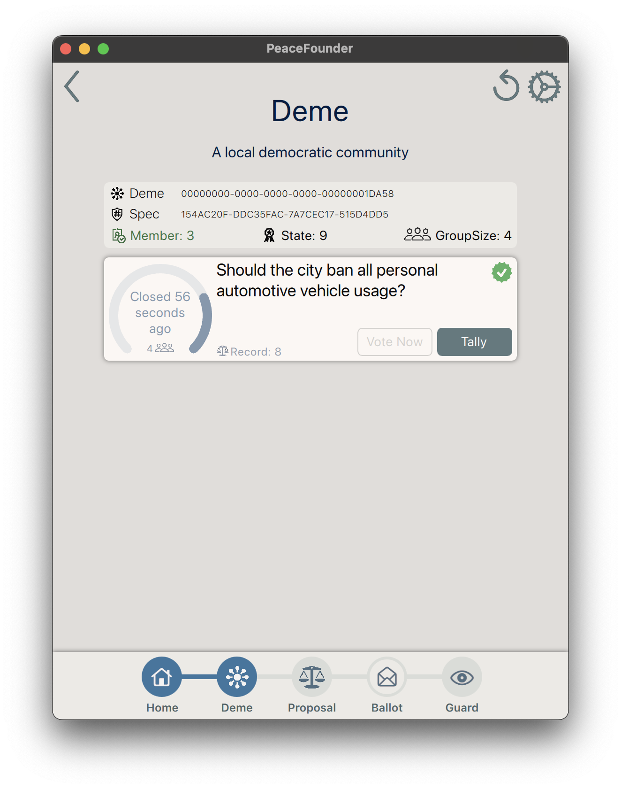
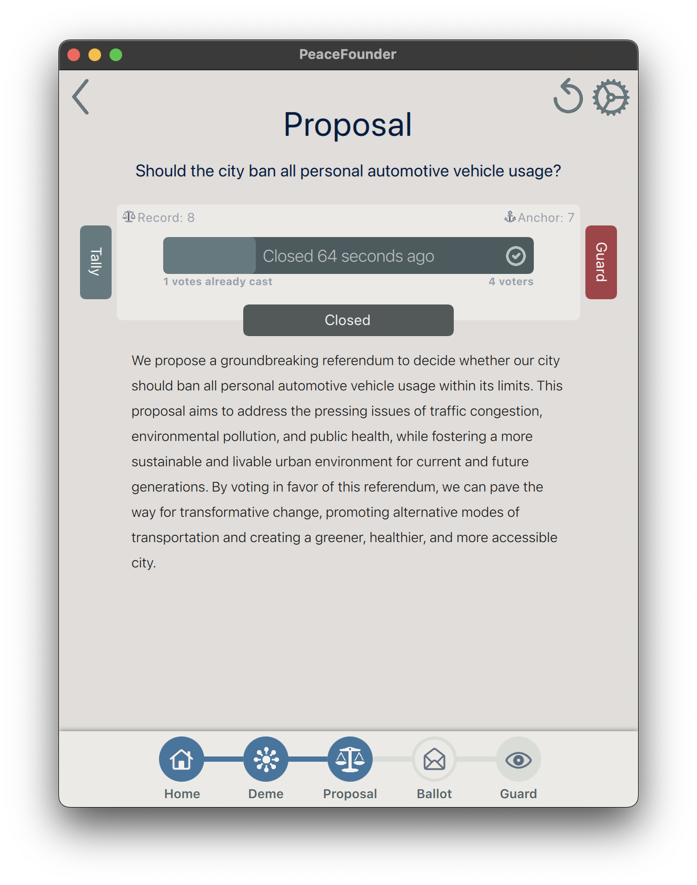
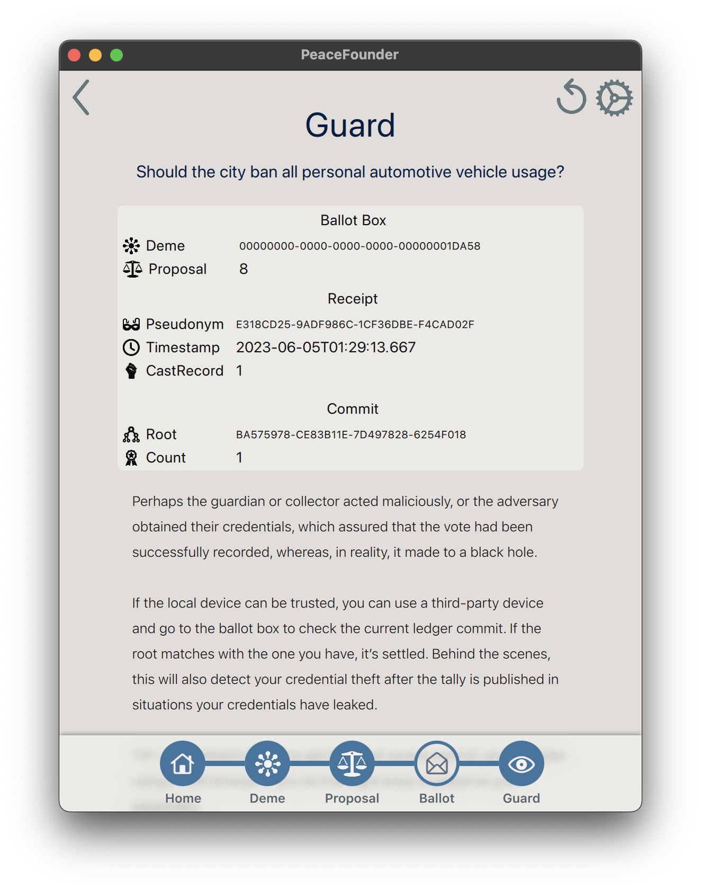

# PeaceFounderGUI

|  |  |  |  |
| ----------------------------- | ----------------------------- | ------------------------------------- | ------------------------------- |

A graphical voter's interface for PeaceFounder was implemented in QML with a backend in Julia. To start, install a recent Julia version, clone this repository and run the `main.jl` file as:

    julia --load main.jl

The installation of relevant packages will be done automatically by Julia's package manager.
